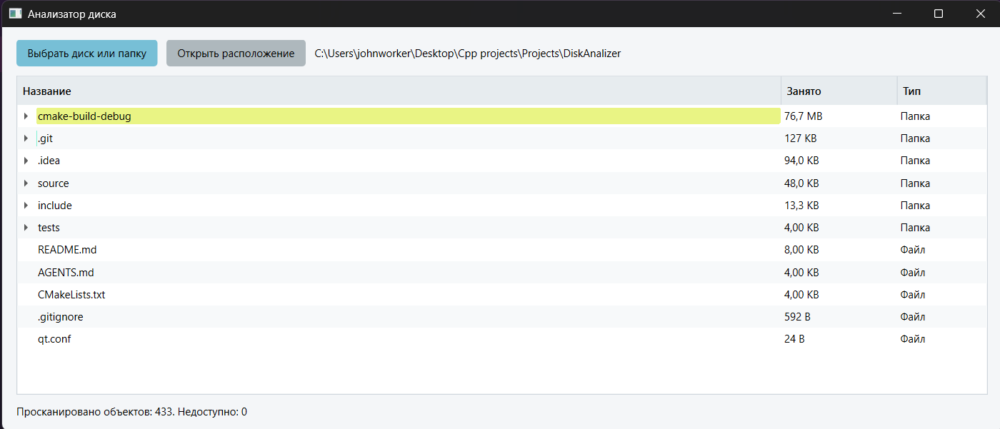

# Disk Analyzer

Disk Analyzer — настольное приложение для анализа занятого места на диске. Оно сканирует выбранный каталог в фоновом потоке, строит дерево файлов и папок и наглядно показывает, какие объекты занимают больше всего пространства.

## Интерфейс



## Возможности

- выбор диска или отдельного каталога через системный диалог;
- рекурсивное отображение файлов и папок в виде дерева;
- сортировка содержимого: сначала каталоги, затем наиболее крупные объекты;
- цветные полосы для визуального сравнения размеров соседних элементов;
- фоновое сканирование без блокировки интерфейса;
- индикатор реального прогресса после предварительного подсчета объектов;
- поддержка путей и имен файлов в Unicode, включая кириллицу;
- отображение числа просканированных и недоступных объектов;
- открытие расположения выбранного файла или каталога;
- безопасный пропуск символических ссылок и reparse points, способных создать цикл.

На Windows приложение показывает выделенное на диске пространство, учитывает альтернативные потоки NTFS и определяет файлы по идентификатору тома и файла. Поэтому несколько жестких ссылок на одни физические данные не увеличивают итоговый размер повторно; такие элементы помечаются в дереве как жесткие ссылки.

## Технологии

- C++23;
- Qt 6.8: Core, Gui, Widgets и Concurrent;
- CMake 3.28+;
- Ninja;
- WinAPI для получения метаданных NTFS;
- CTest для автоматизированной проверки сканера.

## Архитектура

```text
DiskAnalizer/
├── include/
│   ├── domain/       # структуры дерева файлов и результат сканирования
│   ├── services/     # интерфейс сканера файловой системы
│   └── ui/           # модель, делегаты и главное окно Qt
├── source/
│   ├── services/     # подсчет объектов и сканирование каталогов
│   └── ui/           # интерфейс и отображение результатов
├── tests/            # проверка Unicode-путей и учета NTFS
└── CMakeLists.txt    # конфигурация сборки
```

Данные файлового дерева не зависят от интерфейса. Сканер выполняется через `QtConcurrent`, а обновления прогресса поступают в UI через очередь событий Qt. Уведомления ограничены по частоте, чтобы сканирование больших каталогов не перегружало главный поток.

## Требования

- Qt 6.8 или новее;
- компилятор с поддержкой C++23;
- CMake 3.28 или новее;
- Ninja.

Проект настроен на Qt 6.8.1 и MinGW. Путь к другой установке Qt можно передать через `CMAKE_PREFIX_PATH`.

## Сборка

```powershell
cmake -S . -B build -G Ninja `
  -DCMAKE_PREFIX_PATH=A:/applications/Qt/6.8.1/mingw_64
cmake --build build
```

Для локальной конфигурации CLion можно использовать каталог `cmake-build-debug`:

```powershell
cmake -S . -B cmake-build-debug -G Ninja `
  -DCMAKE_PREFIX_PATH=A:/applications/Qt/6.8.1/mingw_64
cmake --build cmake-build-debug
```

На Windows после сборки `windeployqt` автоматически копирует библиотеки и плагины Qt рядом с исполняемым файлом, если утилита найдена CMake.

## Запуск

```powershell
.\build\DiskAnalyzer.exe
```

После запуска:

1. Нажмите «Выбрать диск или папку».
2. Дождитесь завершения сканирования.
3. Раскрывайте каталоги и сравнивайте занимаемое ими пространство.
4. Выберите строку и нажмите «Открыть расположение», чтобы перейти к объекту в Проводнике.

## Тестирование

```powershell
ctest --test-dir cmake-build-debug --output-on-failure
```

Тест создает временный каталог с кириллическими именами и проверяет построение дерева и расчет размера. На Windows он также создает альтернативный поток NTFS и жесткую ссылку, чтобы убедиться, что физически занятое место учитывается только один раз.

## Ограничения

- недоступные файлы и каталоги не прерывают анализ, но учитываются в счетчике ошибок доступа;
- символические ссылки и Windows reparse points не обходятся рекурсивно;
- расширенный расчет выделенного места, альтернативных потоков и жестких ссылок реализован только для Windows.
